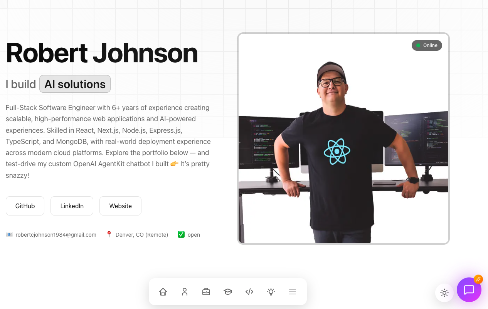
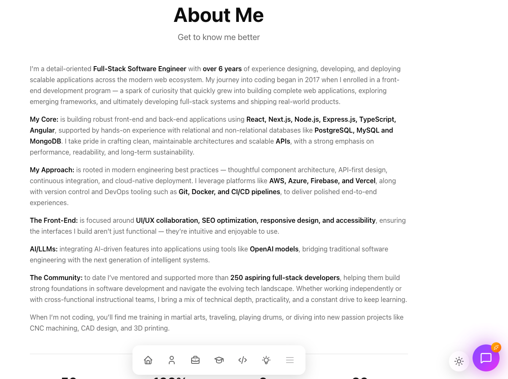
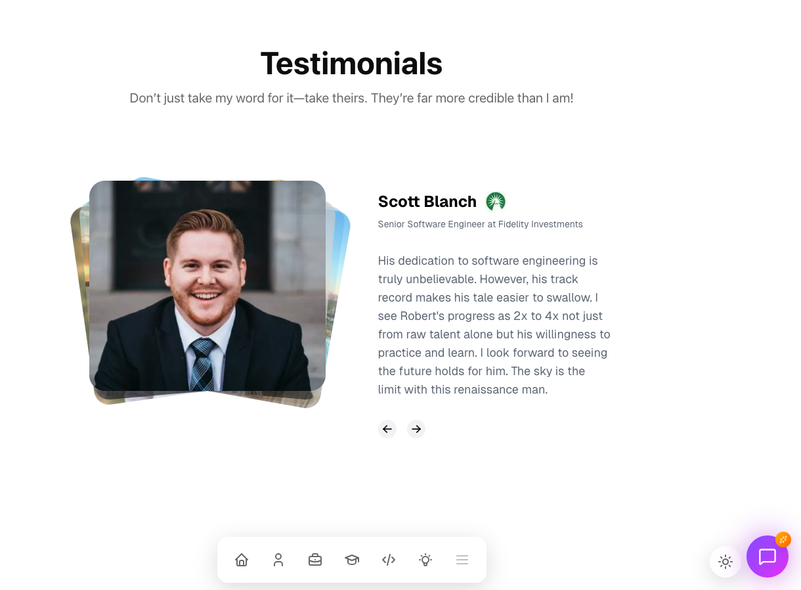
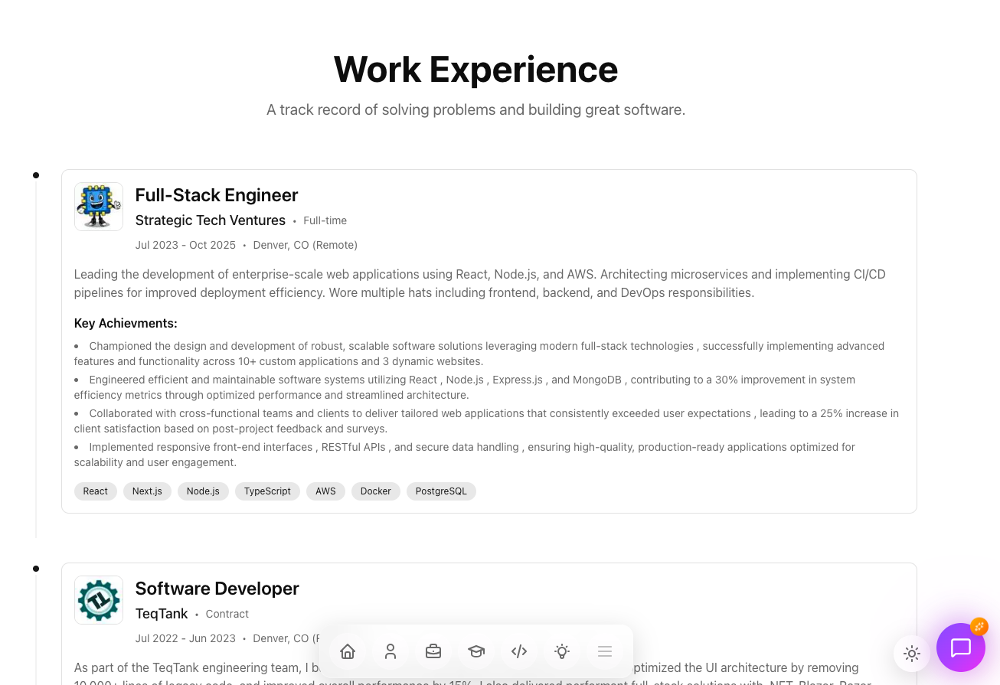
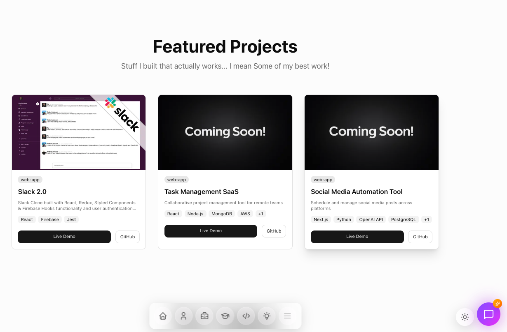
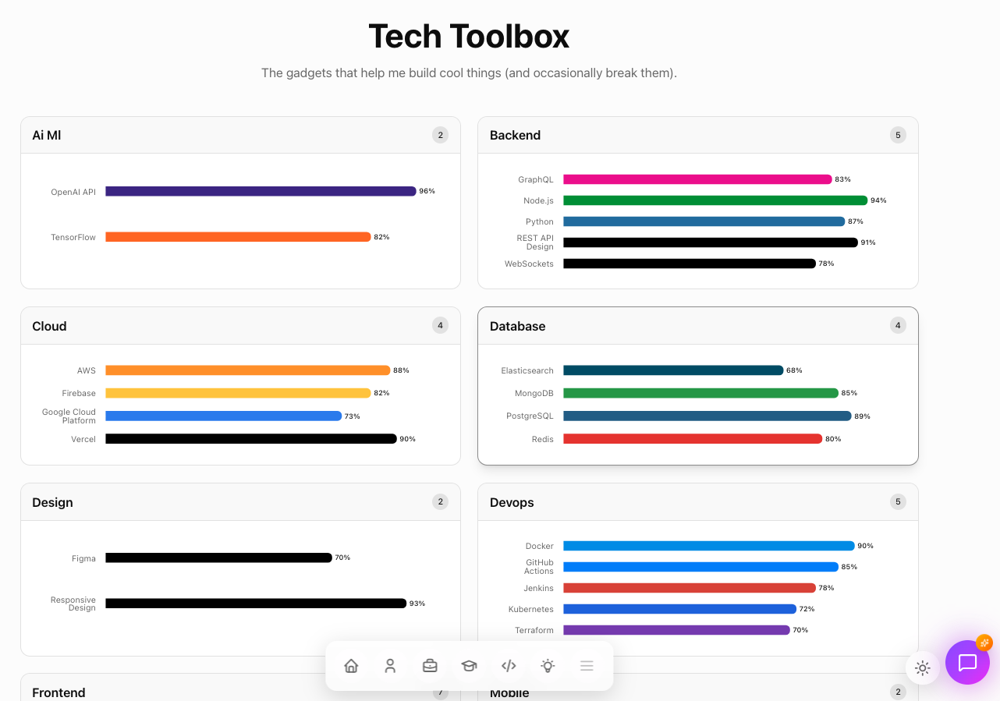
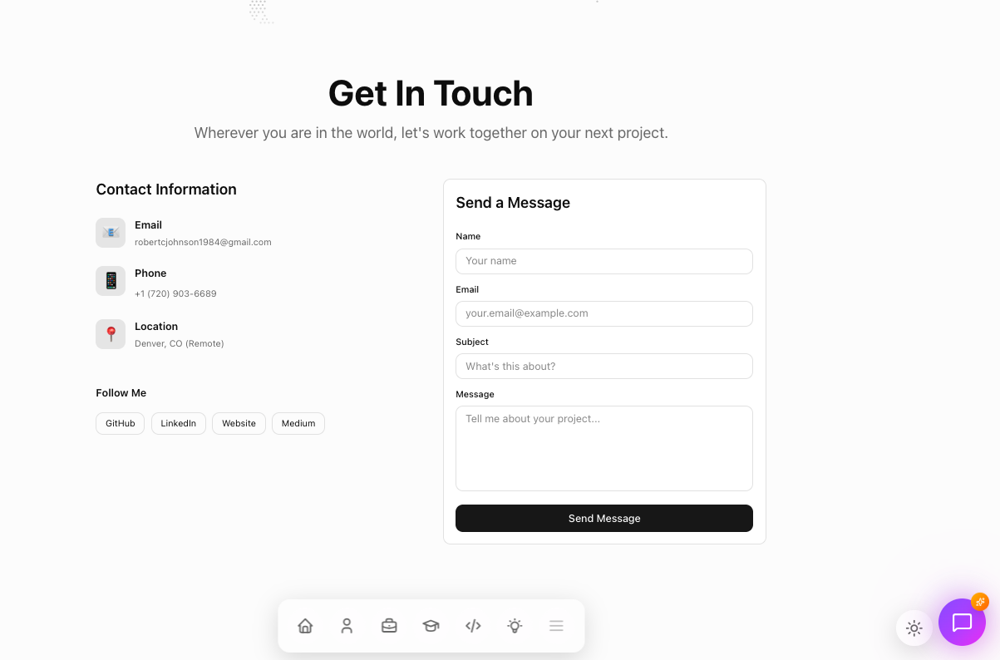

# 🚀 Next-Gen Portfolio — Robert Johnson  
**AI-Powered Developer Portfolio built with Next.js 16, React 19, OpenAI AgentKit, and Sanity CMS**

Live Site: **https://robertjohnsonportfolio.com/**  
Repository: **https://github.com/johnsonr84/nextgen-robertjohnsonportfolio**

---

## 📸 Screenshots  

> **Order: Profile → About → Testimonials → Experience → Projects → Skills → Contact**

### 🧑‍💻 Profile  


### 📄 About  


### ⭐ Testimonials  


### 🧭 Experience  


### 🧱 Projects  


### 🛠 Tech Skills  


### ✉️ Contact  


---

# 🏗️ Tech Stack

This portfolio is built using **the newest generation of web technologies**, including:

### ⚛️ **Frontend / Framework**
- **Next.js 16** (JUST released!)
- **React 19**
- **App Router**
- **Server Components**
- **Turbopack**

### 🤖 **AI + OpenAI**
- **OpenAI AgentKit** — *brand-new AI agent framework*
- **OpenAI ChatKit** — *streaming + multimodal chat*
- **AI Twin Chat** with 3 personalities:
  - **Crisp**
  - **Clear**
  - **Chatty**

### 🗂️ **CMS**
- **Sanity CMS**
- Sanity Studio v3
- **Presentation Tool** for visual side-by-side editor + live preview
- GROQ queries + Vision playground
- Type-safe, auto-generated schema types

### 🔐 **Auth**
- **Clerk** authentication  
  - Prebuilt components  
  - Custom themes  
  - Middleware protection

### 🎨 **Styling & Effects**
- **Tailwind CSS v4** (new core engine)
- **Framer Motion** animations
- **Aceternity UI** (dotted glows, ripples, comet cards)
- Custom gradients, shadows, and floating dock UI

---

# 💻 Core Features

### 🧠 **AI Twin Chat**
- Built with **OpenAI ChatKit**
- 3 personality modes
- Live context memory
- Typing animation + message streaming

### 🧩 **Dual-App Architecture**
- Public-facing portfolio  
- Fully functional **Sanity Studio** (hosted in same repo)

### ✏️ **Visual Content Editing**
- Edit content directly in Sanity Studio  
- See changes **instantly** via Presentation Tool  
- No redeploy needed

### 🦸 **Dynamic Hero Section**
- Auto-rotating animated text
- Floating gradient shapes
- Responsive & performant

### 📊 **Comprehensive Content Sections**
- About  
- Experience timeline  
- Skills bar charts (Recharts)  
- Projects  
- Testimonials  
- Blog (optional)  
- Achievements  
- Contact  

### 🧭 **Floating Navigation Dock**
- macOS-style glass dock  
- Scroll-aware highlighting  
- Smooth hover magnification

---

# 🛠️ Advanced Concepts

### 🤖 **OpenAI AgentKit Integration**
- AI agent with context, personality, and messaging
- Extendable agent actions

### 🎛️ **Sanity Visual Editing**
- Live preview (no refresh)
- Draft mode (preview unpublished content)
- Reusable GROQ helpers
- Vision query playground

### 🔧 **Next.js 16 Server Actions**
- Server-safe form submissions  
- Contact form handler  
- Edge-ready API routes  

### 🧬 **Type-Safe Everything**
- End-to-end TypeScript  
- Auto-generated types from Sanity schemas  
- Strong linting with **Biome**

### ♿ **Accessibility First**
- Radix UI primitives  
- Semantic HTML  
- Color contrast compliance  

---

# 🚀 Deployment

### 🎯 **Production Setup**
- **Vercel** — Portfolio front-end
- **Sanity** — Hosted Studio & dataset
- Continuous deployment  
- Automatic image optimization  

### 📦 **Content Management**
- 61 starter documents imported via script
- CMS-driven hero, skills, timeline, testimonials, and project cards

### 🪄 **Custom Components**
- Animated testimonial carousel
- World map component
- Interactive dock
- Charts with **Recharts**
- Aceternity UI animations

### 🧰 **Modern Tooling**
- **Biome** for speed-of-light linting & formatting  
- **Lucide + Tabler icons**  
- **Metadata and SEO configuration**

---

# 🧑‍💻 Local Development

```bash
git clone https://github.com/johnsonr84/nextgen-robertjohnsonportfolio
cd nextgen-robertjohnsonportfolio

npm install
npm run dev

Local will run:
- Next.js app → http://localhost:3000
- Sanity Studio → http://localhost:3000/studio

nextgen-robertjohnsonportfolio/
│
├── app/                     # Next.js 16 App Router
│   ├── (site)/              # Portfolio pages
│   ├── studio/              # Sanity Studio
│   └── api/                 # Server Actions + API routes
│
├── sanity/                  # Schemas, config, GROQ helpers
│   ├── schemaTypes/
│   └── utils/
│
├── components/              # UI components
│   ├── ai/
│   ├── charts/
│   ├── testimonials/
│   └── ui/
│
├── public/
│   └── screenshots/         # README images
│
└── tailwind.config.js

Robert Johnson
Full-Stack Software Engineer • AI Builder
https://robertjohnsonportfolio.com

